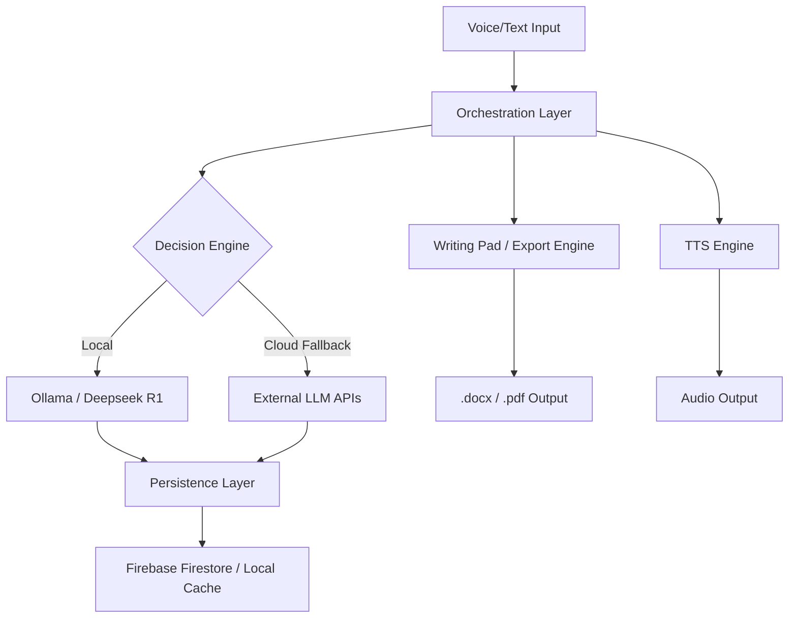

##  Overview

**Theaashay** is a sophisticated, locally-hosted AI assistant designed for security-conscious users who demand total data sovereignty without sacrificing advanced capabilities. Powered by **Deepseek R1** via **Ollama**, it integrates professional-grade voice orchestration, persistent vector-like memory, and a dynamic writing environment—all within a zero-latency, zero-tracking ecosystem.

## 🏗️ Technical Architecture

Theaashay operates on a hybrid-local architecture, maximizing local compute while utilizing minimal cloud resources for lightweight state persistence.

## Key Features

### Neural Core & Orchestration
- **Deepseek R1 Integration:** High-performance local inference via Ollama REST API (`localhost:11434`).
- **Hybrid Inference:** Seamlessly bridge to external providers (OpenAI, Anthropic) for specialized tasks via configurable API tunneling.
- **System Prompt Injection:** Advanced behavioral modeling and tone control injected at the inference layer for consistent personality.

### Modality & Interface
- **Real-time STT Pipeline:** Low-latency speech-to-intent processing.
- **Streamed TTS:** Asynchronous, sentence-by-sentence audio synthesis for natural interaction flow.
- **Hybrid UI/UX:** A glassmorphic, tech-centric interface built with React & Vite, optimized for both visual and auditory data streams.

### Productivity Suite
- **Volatile Writing Pad:** An encrypted, session-only workspace for drafting sensitive documents, emails, and code.
- **Multi-Format Export:** Standardized document generation for `.docx` and `.pdf` using open-source compiler libraries.
- **Persistent Context:** Historical conversation state synchronization with Firebase Firestore, ensuring continuity across sessions while maintaining user privacy.

## Tech Stack

- **LLM Engine:** [Ollama](https://ollama.ai/) + [Deepseek R1](https://deepseek.com/)
- **Frontend:** React 19, Vite, Tailwind CSS 4, Motion (framer-motion)
- **Database:** Firebase Firestore (Metadata & Logs)
- **Icons:** Lucide React
- **Runtime:** Node.js

## Roadmap v2.0

- [ ] **Autonomous Agents:** Browser automation via Playwright for web-based task execution.
- [ ] **Ecosystem Integration:** Deep linking with Google Calendar and Email APIs.
- [ ] **Local FS Control:** Direct, secure management of local file systems via natural language.
- [ ] **Proactive Intel:** Context-aware suggestions based on local system activity.

Proprietary License. All rights reserved. Code is provided for personal use and evaluation only.

---

 

